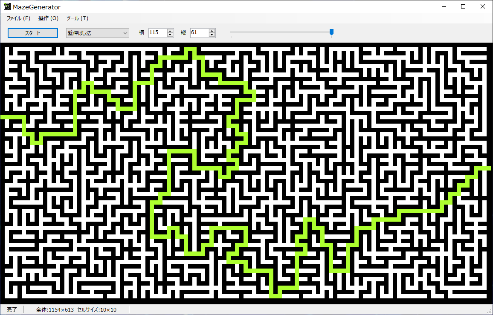
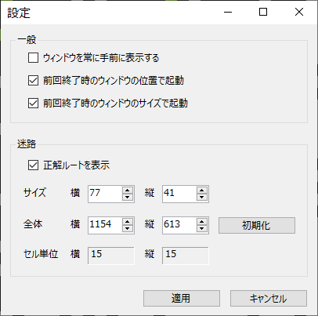

# MazeGenerator

## 概要

- 迷路を自動生成するアプリケーションです。
- パラメータを調整することで迷路の生成過程を眺めて楽しむこともできます。

## 機能

- 複数アルゴリズムによる、迷路の自動生成機能。
- 迷路の正解ルート表示機能。
- 生成した迷路の画像キャプチャ機能。
- 生成した迷路のCSVエクスポート機能。
- スライダーによる、迷路の生成スピード切り替え機能など。